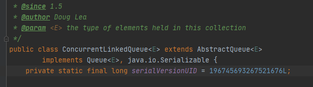
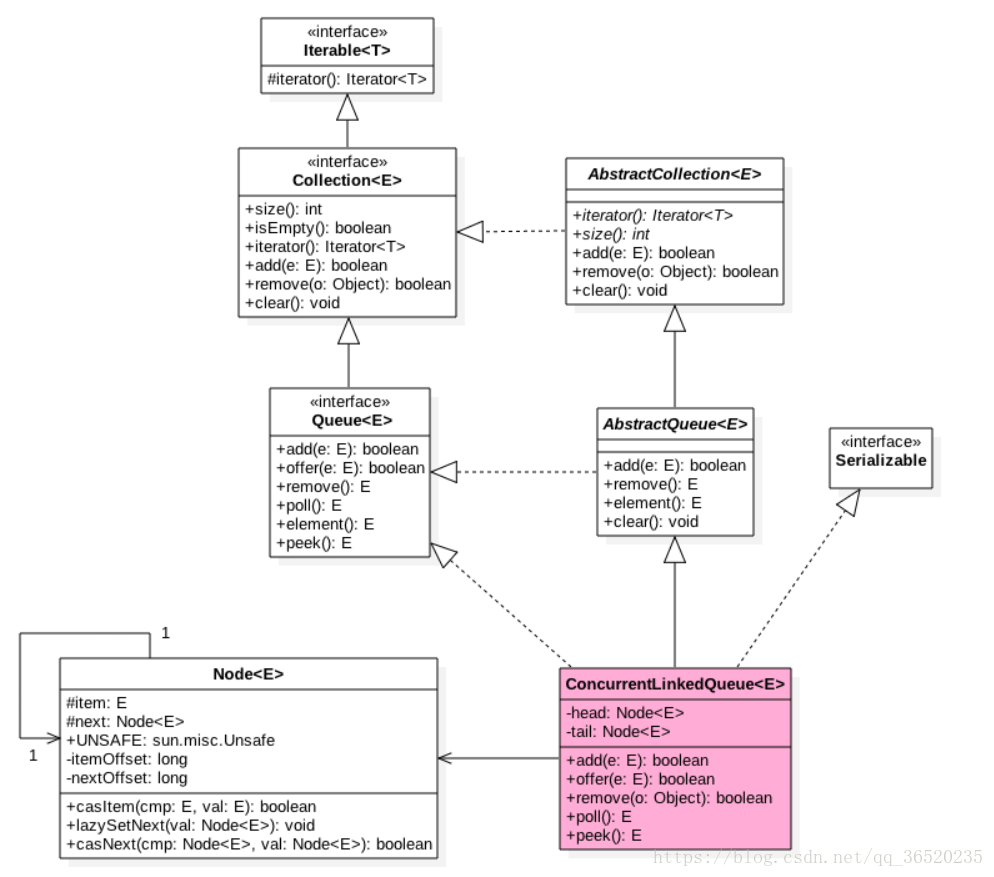
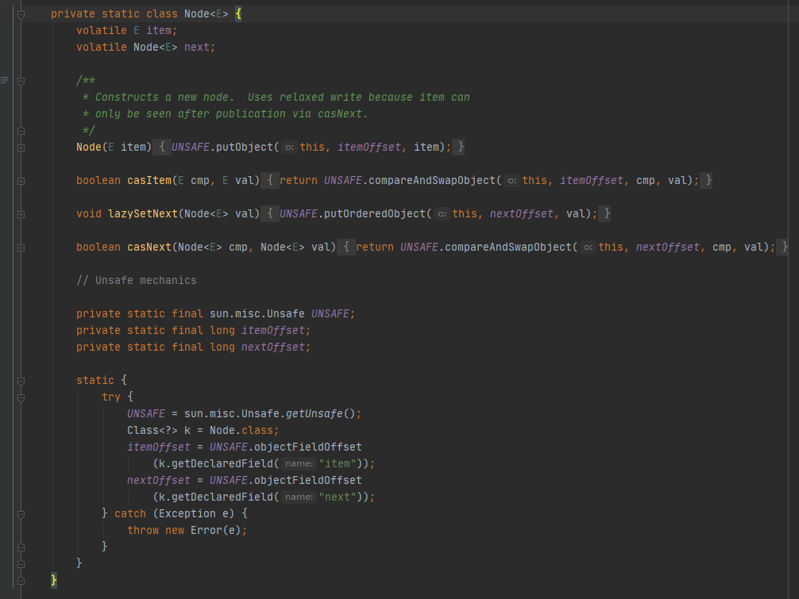
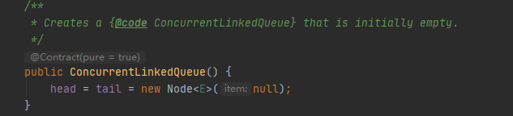
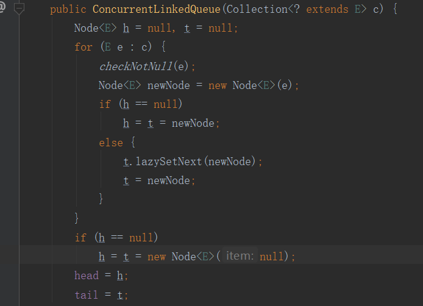

# ConcurrenLinkedQueue:

## 	1.concurrentlinkedqueue的简单了解和用途

> 继承的是AbstractQueue接口，实现的是Queue接口。
>
> 使用的是单向链表的形式来实现队列  

​		





## 2.ConcurrentLinkedQueue的部分源码解读

> 定义一个Node方法体，使用volatile对元素item和next域进行修饰，这样就可以修改到主内存，全部线程可见。



从上图可以看到，在Node构造函数中，使用了unsafe类，分别设置、比较并替换了item和next域的值。但是对next域使用了**unsafe.putOrderedObject**方法，实现了非堵塞的写入，并且写入不会被指令重排序，能够实现快速的**存储-存储**屏障（禁止重排的屏障），而不是较慢的**存储-加载**屏障。虽然导致对next域的修改并不会对其他线程立即可见(但只会在纳秒级别)。使用了unsafe类的cas算法保证了出入队列的一致性。CAS其实是一条CPU原子指令，其作用是让CPU先进行比较两个值是否相等，然后原子的更新某个位置的值，__即cas是基于硬件平台的，JVM封装了汇编调用，AtomicInteger类则使用了这些封装后的接口(atomic底层提供的是volatile和cas来实现的对数据的更改__，volatile实现了数据修改的主内存可见，禁止重排序，cas比较并替换实现了数据更新的原子性)。

> 而java的原子类是通过Unsafe类实现的，所以简单了解一下unsafe类。主要提供的是执行级别较低、且不安全操作的方法(java没有为我们提供unsafe类的对外API),例如：访问和管理系统内存资源。


> ConcurrentLinkedQueue中头尾节点的定义：concurrentlinkedqueue持有head和tail头尾指针管理队列，用来存放队首和队尾的节点信息。

```
private transient volatile Node<E> head;
private transient volatile Node<E> tail;
```

如此，我们便可以在O(l)的时间内获取到头结点和尾节点的信息。head和tail除了使用**volatile**进行原子修饰以外，还使用了**transient**进行修饰。transient的作用主要是使其修饰的变量可以不被序列化(transient只能修饰变量，同时其所在的类需要继承serializable)。


> 类的构造函数，对head和tail进行初始化，指向一个空的域。




> 包含给定集合的构造函数，用于创建一个包含该集合给定元素的concurrentLinkedqueue



如上图，使用h，t分别表示临时的头尾节点，遍历集合元素，每次都会使用checkNotNull方法判断元素是否存在，为空就会抛出空指针异常。每次取出的对象会包装成一个新的node节点，如果ht都是指向空域的话，就会同时赋值，否则，使用lazysetnext，延迟设置，将t永远指向最新加入的一个节点。再之后，将head和tail分别指向h和t。


> 其中，lasySetNext这里直接调用了UNSAFE对象的putorderedObject方法，三个参数分别是当前node，偏移量，下一个node对象。**实现了低延迟代码的非阻塞写入。**

```
void lazySetNext(Node<E> val) {
    UNSAFE.putOrderedObject(this, nextOffset, val);
}
```

和另一个putObjectVolatile相比，少了内存屏障，提升了性能，相当于其的内存非立即可见版本。（此处打上？，对于lazySetNext的具体原理还是不清楚）

### 3.concurrentlinkedqueue的一些核心用法

> add方法，其本质还是调用队列的offer方法

```
public boolean add(E e) {
    return offer(e);
}
```

> **offfer方法是核心方法，由于队列是无边界的，所以不会返回false**  

```
public boolean offer(E e) {
	//检查元素不为空
    checkNotNull(e);
    //为该元素新生一个节点
    final Node<E> newNode = new Node<E>(e);

    for (Node<E> t = tail, p = t;;) {//无限循环 p为尾节点，t为tail节点，默认相等
        Node<E> q = p.next;//q作为p的下一个节点
        if (q == null) { //q为空，说明当前p节点为尾节点，则不会将tail节点设置为当前入队节点
            // p is last node
            if (p.casNext(null, newNode)) { //比较并替换p的next域为新的节点
                // Successful CAS is the linearization point
                // for e to become an element of this queue,
                // and for newNode to become "live".
                //如果p与t的值不等，即tail节点不是尾节点，则将入队节点设置为tail
                //如果失败，则说明有其他的线程移动过tail
                if (p != t) // hop two nodes at a time 
                    casTail(t, newNode);  // Failure is OK. 比较并替换尾节点
                return true;
            }
            // Lost CAS race to another thread; re-read next
        }
        else if (p == q) //如果p和q节点相等，说明队列为空，刚刚初始化，所以返回head节点
            // We have fallen off list.  If tail is unchanged, it
            // will also be off-list, in which case we need to
            // jump to head, from which all live nodes are always
            // reachable.  Else the new tail is a better bet.
            //原来的尾结点与现在的尾结点是否相等，若相等，则p赋值为head，否则，赋值为现在的尾结点
            p = (t != (t = tail)) ? t : head;
        else
            // Check for tail updates after two hops.
            //如果p有next节点，表示p的next节点是尾节点，则需要重新更新p后将它指向next节点。
            p = (p != t && t != (t = tail)) ? t : q;
    }
}
```

这里体现了尾节点的延迟设置。具体过程为：首先将入队节点设置为当前队列尾节点的下一个节点；第二是更新tail节点，在入队列前，如果tail节点的next节点不为空，则将入队节点设置为tail节点，如果tail节点的next节点为空，则将入队节点设置成tail的next节点，所以tail节点不总是为尾节点。

改代码主要表达了以下几个意思：从第一个if判断就来判定p有没有next节点如果没有则p是尾节点则将入队节点设置为p的next节点，同时如果tail节点不是尾节点则将入队节点设置为tail节点。如果p有next节点则p的next节点是尾节点，需要重新更新p后将它指向next节点。还有一种情况p等于p的next节点说明p节点和p的next节点都为空，表示这个队列刚初始化，正准备添加数据，所以需要返回head节点。


>concurrentlinkedqueue的出队操作,**核心函数**poll()函数。和offer一样，都会有一个延迟的操作。

```
public E poll() {
	//设置其实节点
    restartFromHead:
    for (;;) {
    	//p表示head节点，即需要出队的节点
        for (Node<E> h = head, p = h, q;;) {
        	//获取p节点的元素
            E item = p.item;
			//如果p节点的元素不为空，使用cas算法将p节点引用的元素设为Null
            if (item != null && p.casItem(item, null)) {
                // Successful CAS is the linearization point
                // for item to be removed from this queue.
                //如果p节点不是head节点，则更新head节点为下一个节点
                if (p != h) // hop two nodes at a time
                    updateHead(h, ((q = p.next) != null) ? q : p);
                return item;
            }
            //如果p节点的下一个节点为null，则说明这个队列为空，更新head节点
            else if ((q = p.next) == null) {
                updateHead(h, p);
                return null;
            }
            //节点出队失败的情况下，重新跳到restartFromHead进行出队
            else if (p == q)
                continue restartFromHead;
            else
            	//继续向后走一步，尝试移除元素
                p = q;
        }
    }
}
```

> 更新节点的updateHead方法

```
final void updateHead(Node<E> h, Node<E> p) {
	//如果两个节点不相同，尝试使用CAS	指令原子更新head指向新头结点
    if (h != p && casHead(h, p))
    	//将旧的头结点指向自身实现删除
         h.lazySetNext(h);
}

```

整个出队的操作可以归纳为：首先获取head节点的元素，并判断head节点元素是否为空，如果为空，表示另外一个线程已经进行了一次出队操作将该节点的元素取走，如果不为空，则使用CAS的方式将head节点的引用设置成null，如果CAS成功，则直接返回head节点的元素，如果CAS不成功，表示另外一个线程已经进行了一次出队操作更新了head节点，导致元素发生了变化，需要重新获取head节点。如果p节点的下一个节点为null，则说明这个队列为空（此时队列没有元素，只有一个伪结点p），则更新head节点。


> peek()方法，返回当前队列头部的元素

```
    public E peek() {
        restartFromHead:
        for (;;) {
            for (Node<E> h = head, p = h, q;;) {
                E item = p.item;
                //其实这里的if是将poll方法的中前两个if做了合并
                if (item != null || (q = p.next) == null) {
                    updateHead(h, p);
                    return item;
                }
                else if (p == q)
                    continue restartFromHead;
                else
                    p = q;
            }
        }
    }
```

（peek中为什么没有使用first()方法？）


> concurrentlinkedqueue的remove函数，

```
    public boolean remove(Object o) {
        if (o != null) {
            Node<E> next, pred = null;
            //p为当前节点，pred为p的前驱，next为p的后继节点
            for (Node<E> p = first(); p != null; pred = p, p = next) {
                boolean removed = false;
                E item = p.item;
                //如果item为null，则代表元素已经失效
                if (item != null) {
                	//如果获取不到删除的元素，就一直遍历下去
                    if (!o.equals(item)) {
                    	//succ获取next引用
                        next = succ(p);
                        continue;
                    }
                    //将需要删除的元素置为空
                    removed = p.casItem(item, null);
                }

                next = succ(p);
                if (pred != null && next != null) // unlink
                    pred.casNext(p, next);
                if (removed)
                    return true;
            }
        }
        return false;
    }
```

remove方法需要指定删除，也即需要遍历整个链条。如果找到了则立马把当前的item修改为null，然后获取到下一个节点，然后用前一个指向下一个完成删除。这里的删除分2步，第一步首先把item修改为Null,第二步然后修改前一个链条和下一个链条的关系完成删除。

> concurrentlinkedqueue的contanis方法，需要遍历整个链条，通过equals方法找到需要查找的对象

```
    public boolean contains(Object o) {
        if (o == null) return false;
        for (Node<E> p = first(); p != null; p = succ(p)) {//如果没有，就会一直循环找下去，返回布尔值
            E item = p.item;
            if (item != null && o.equals(item))
                return true;
        }
        return false;
    }
```


> concurrentlinkedqueue的size方法和isEmpty方法

```
    public int size() {
        int count = 0;
        for (Node<E> p = first(); p != null; p = succ(p))
            if (p.item != null)
                // Collection.size() spec says to max out
                if (++count == Integer.MAX_VALUE)
                    break;
        return count;
    }
    
    
        public boolean isEmpty() {
        return first() == null;
    }
```

从上可以看到，size方法是需要遍历整个链表的，而isEmpty方法只需要判断第一个结点(不一定是head结点)是否为空即可。所以isEmpty的性能要好于size方法。


> addll()方法，采用的方法并不是直接在链表后逐个元素的添加，因为这样不能保证高并发的连续性和正确性。而是先对自身遍历，把每一个对象包装成node，形成一个链条，然后再往链条上追加。

```
    public boolean addAll(Collection<? extends E> c) {
        if (c == this)
            // As historically specified in AbstractQueue#addAll
            throw new IllegalArgumentException();

        // Copy c into a private chain of Nodes
        Node<E> beginningOfTheEnd = null, last = null;
        for (E e : c) { // 遍历集合，包装成新的node，然后组成一个新的链条
            checkNotNull(e);
            Node<E> newNode = new Node<E>(e);
            if (beginningOfTheEnd == null)
                beginningOfTheEnd = last = newNode;
            else {
                last.lazySetNext(newNode);
                last = newNode;
            }
        }
        if (beginningOfTheEnd == null)
            return false;

        // Atomically append the chain at the tail of this collection
        for (Node<E> t = tail, p = t;;) { 
            Node<E> q = p.next;
            //tail的next为null，则直接把我们前面链条的第一个然后连接到next即可，然后把tail指向最后一个，如果失败后先把t指向			   //tail然后把最后一个的next指向null,再进行一次tail的改变。
            if (q == null) {
                // p is last node
                if (p.casNext(null, beginningOfTheEnd)) {
                    // Successful CAS is the linearization point
                    // for all elements to be added to this queue.
                    if (!casTail(t, last)) {
                        // Try a little harder to update tail,
                        // since we may be adding many elements.
                        t = tail;
                        if (last.next == null)
                            casTail(t, last);
                    }
                    return true;
                }
                // Lost CAS race to another thread; re-read next
            }
            else if (p == q) //如果为空，先更新p，返回head节点
                // We have fallen off list.  If tail is unchanged, it
                // will also be off-list, in which case we need to
                // jump to head, from which all live nodes are always
                // reachable.  Else the new tail is a better bet.
                p = (t != (t = tail)) ? t : head;
            else
                // Check for tail updates after two hops.
                p = (p != t && t != (t = tail)) ? t : q;
        }
    }
```


> toArray()方法，初始化一个ArraList，然后通过succ方法遍历链表，将元素逐个加入arraylist中，最后调用arrays.conpyof方法，返回结果。

```
    public Object[] toArray() {
        // Use ArrayList to deal with resizing.
        ArrayList<E> al = new ArrayList<E>();
        for (Node<E> p = first(); p != null; p = succ(p)) {
            E item = p.item;
            if (item != null)
                al.add(item);
        }
        return al.toArray();
    }
```

toArray有两种，一种是如上返回一个Object数组，另一种是返回到指定的数组中：

```
public <T> T[] toArray(T[] a) {...}
```


> 此外还有Iterator，hasNext等方法，主要调用first和succ方法，进行节点元素的迭代。


ConcurrentLinkedQueue的延迟更新策略：

其核心方法，poll和offer都使用了这种策略

**tail:**当tail指向的节点的下一个节点不为null的时候，会执行定位队列真正的队尾节点的操作，找到队尾节点后完成插入之后才会通过casTail进行tail更新；当tail指向的节点的下一个节点为null的时候，只插入节点不更新tail

**head:**当head指向的节点的item域为null的时候，会执行定位队列真正的队头节点的操作，找到队头节点后完成删除之后才会通过updateHead进行head更新；当head指向的节点的item域不为null的时候，只删除节点不更新head。

这种策略是为了防止高并发时，每次都要执行CAS更新tail，对性能的消耗是比较大的。为了减少这个消耗，所以每间隔一次进行CAS更新。


### 4.适合的场景

concurrentlinkedqueue通过无锁做到了高并发，其无锁的关键是CAS的循环比较，使得其变为高性能的队列。在并发量非常大的情况下，会取得较好的性能。但是，如果线程数量过多，也会造成不断地CAS的情况，消耗大量CPU资源。

使用场景：多线程共享访问一个公共的Collections；多消息队列；多生产者，多消费者时，使用会提升性能。